# Terraform을 이용한 블로그 및 시스템 모니터링 구축

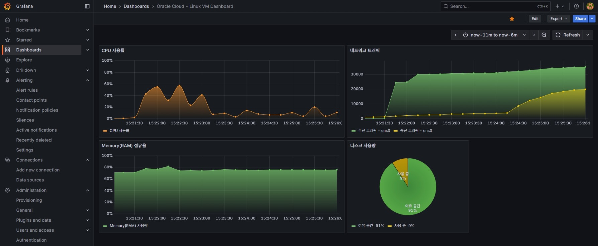

<br>

## 📖 프로젝트 소개
- **프로젝트 주제 :** Terraform을 이용하여 클라우드에 블로그 구축, Prometheus와 Grafana를 이용하여 시스템 모니터링 및 알림 체계 구축
- **프로젝트 기간 :** 2025-08-07 ~ 2025-09-15
- **프로젝트 형태 :** IaC(Terraform) 공부 및 실습하는 개인 프로젝트
- **프로젝트 설명**
  - Terraform을 이용하여 Oracle Cloud에서 인스턴스, 서브넷 등 리소스를 생성 및 관리합니다.
  - 클라우드의 Linux VM 인스턴스에서 Apache2, PHP, MariaDB를 이용하여 WordPress 블로그를 구축합니다.
  - Prometheus, Grafana를 이용하여 시스템 상태 메트릭을 저장하고, 이를 시각화 및 모니터링하는 체계를 구축합니다.
  - Grafana에서 특정 메트릭의 임계치를 설정하고, 이를 초과할 경우 알림을 전송하는 알림 체계를 구축합니다.

<br>

## 🗂️ 목차

1. [클라우드 환경 및 기술 스택](#1-%EF%B8%8F-클라우드-환경-및-기술-스택)
2. [프로젝트 기간](#2--프로젝트-기간)
3. [프로젝트 목표 및 중점 사항](#3--프로젝트-목표-및-중점-사항)
4. [클라우드 리소스 정의 및 생성](#4-%EF%B8%8F-클라우드-리소스-정의-및-생성)
5. [시스템 모니터링 체계 구축](#5--시스템-모니터링-체계-구축)
6. [알림 체계 구축](#6--알림-체계-구축)
7. [트러블 슈팅](#7--트러블-슈팅)
8. [프로젝트 성과 및 느낀점](#8--프로젝트-성과-및-느낀점)

<br>

## 1. 🛠️ 클라우드 환경 및 기술 스택

- Cloud : Oracle Cloud (VM.Standard.E2.1.Micro)
- IaC : Terraform
- OS : Ubuntu 24.04.3 LTS
- Web : Apache2, PHP, WordPress (CMS)
- DB : MariaDB, phpMyAdmin
- Monitoring : Prometheus, Node Exporter, Grafana

<br>

## 2. 📆 프로젝트 기간

- 프로젝트 기간 : 2025-08-07 ~ 2025-09-15

<br>

## 3. 🎯 프로젝트 목표 및 중점 사항

- Terraform을 이용하여 Oracle Cloud에서 다음과 같은 리소스를 생성 및 관리합니다.
  - Linux VM 인스턴스
  - VCN(가상 클라우드 네트워크)
  - 퍼블릭 및 프라이빗 서브넷
  - 인터넷 게이트웨이
  - 라우팅 테이블
  - OpenSSH 규격의 SSH 키 쌍(공개키, 비밀키)
- Apache2, PHP, MariaDB를 이용하여 WordPress 블로그를 구축합니다.
  - Apache2 웹 서버와 PHP를 설치하고, MariaDB와 연동하여 WordPress 블로그를 설치 및 구축합니다.
  - phpMyAdmin을 설치하여 MariaDB 데이터베이스를 웹에서 관리할 수 있도록 합니다.
- Prometheus, Grafana를 이용하여 시스템 상태 메트릭을 수집, 저장, 시각화 및 모니터링하는 체계를 구축합니다.
  - Prometheus, Node Exporter 플러그인을 설치하여 CPU, RAM, Network, Disk 사용량 등의 시스템 메트릭 정보를 수집하고 저장합니다.
  - Grafana를 이용하여 Prometheus에 저장된 메트릭 정보를 시각화하고, 대시보드를 구성합니다.
  - PromQL을 활용하여 기본적으로 제공되는 메트릭 외에도 사용자 정의 메트릭을 생성하여 모니터링할 수 있는 방법을 배웁니다.

<br>

## 4. ☁️ 클라우드 리소스 정의 및 생성

- Oracle Cloud와 Terraform을 연동하고, OCI 공급자(Provider)와 tfvars 환경 변수 등을 설정.
- Linux VM 인스턴스, VCN(가상 클라우드 네트워크), 서브넷. 인터넷 게이트웨이, 라우팅 테이블 리소스 정의 및 생성.
- Terraform으로 생성한 Linux VM 인스턴스에 Apache2, PHP, MariaDB를 설치하여 WordPress 블로그 구축.

<table>
  <tr>
    <td align="center">
      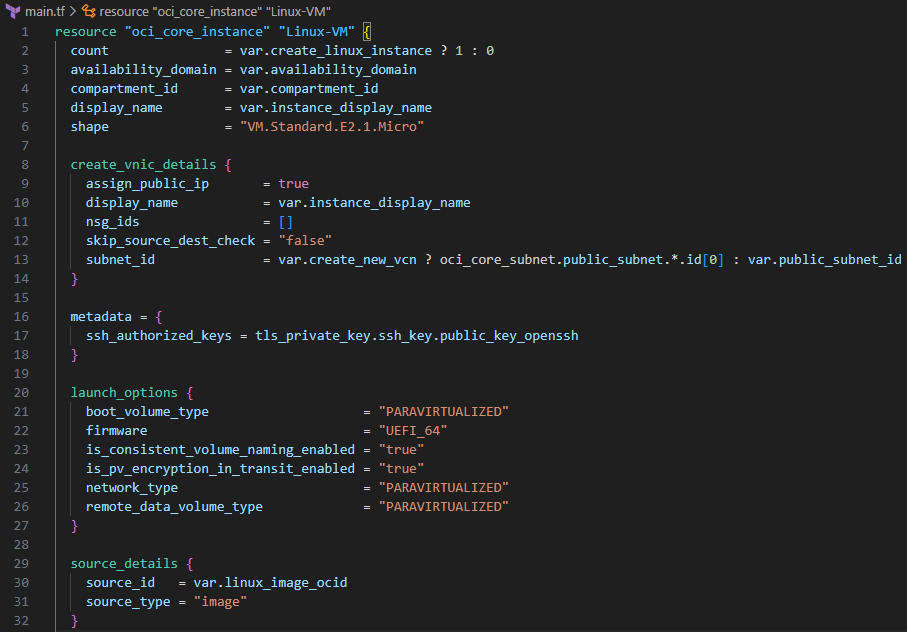<br>
      <sub>Terraform 인스턴스 생성 코드</sub>
    </td>
    <td align="center">
      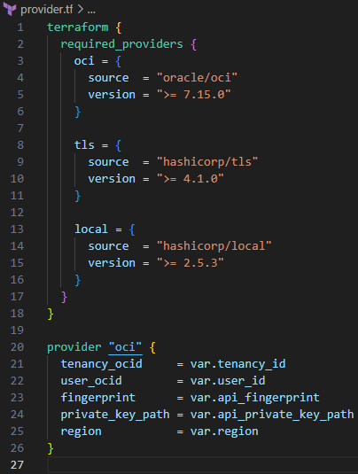<br>
      <sub>Terraform Provider 코드</sub>
    </td>
  </tr>
  <tr>
    <td align="center">
      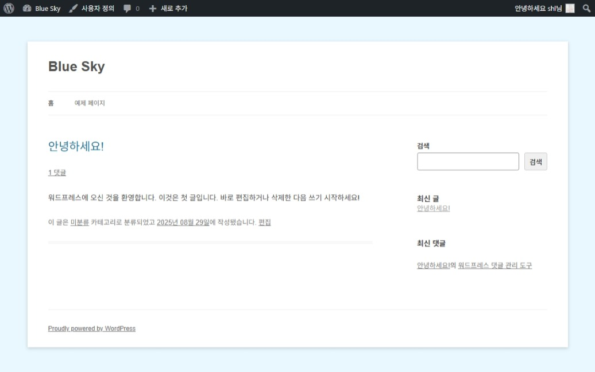<br>
      <sub>WordPress 블로그 접속 화면</sub>
    </td>
    <td align="center">
      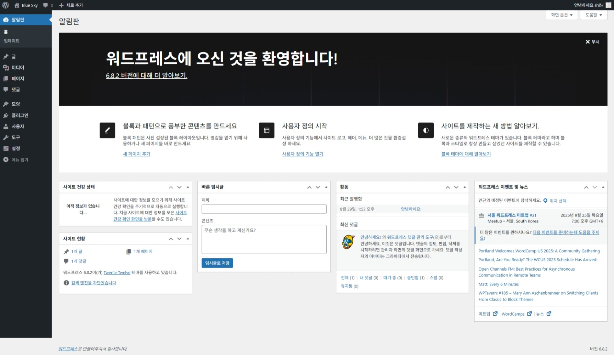<br>
      <sub>WordPress 블로그 관리자 화면</sub>
    </td>
  </tr>
</table>

<br>

## 5. 🔭 시스템 모니터링 체계 구축

- Prometheus와 Node Exporter 플러그인을 설치하여 시스템 상태 메트릭을 DB에 저장.
- Grafana에서 PromQL 쿼리를 입력하여 시스템에 저장된 메트릭을 시각화 및 모니터링하는 체계 구축.

<table>
  <tr>
    <td align="center">
      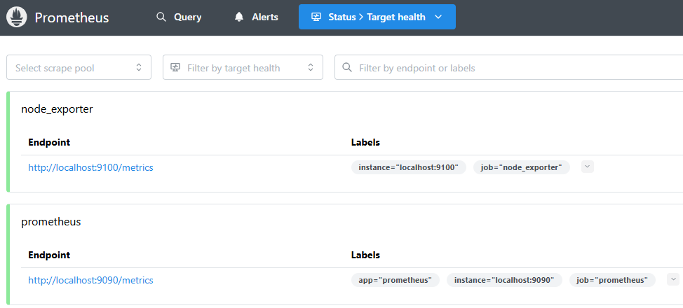<br>
      <sub>Prometheus 및 플러그인 설치 상태</sub>
    </td>
    <td align="center">
      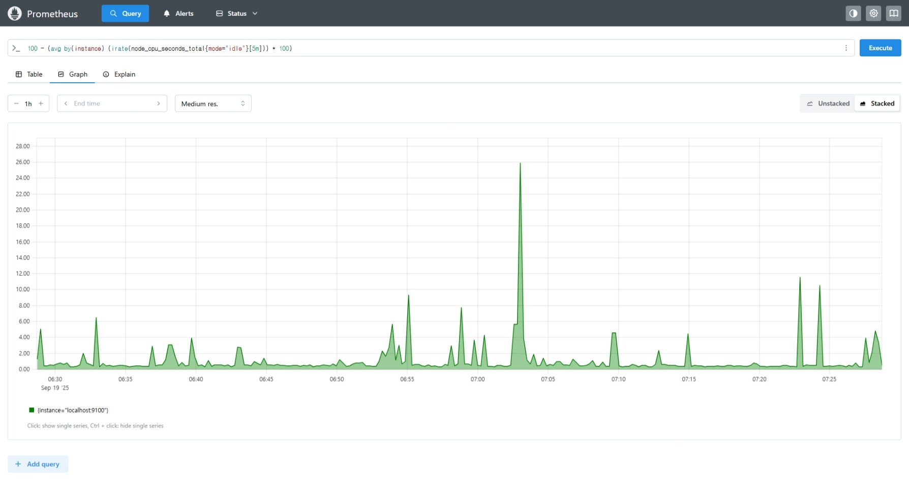<br>
      <sub>Prometheus 메트릭 그래프</sub>
    </td>
  </tr>
  <tr>
    <td align="center">
      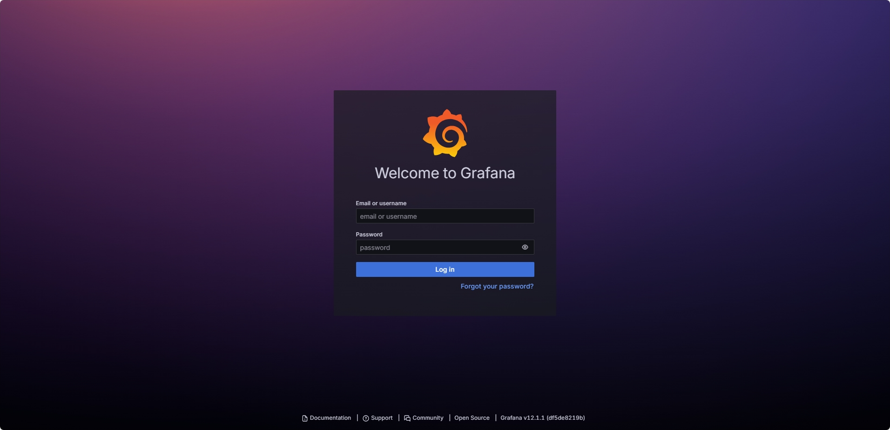<br>
      <sub>Grafana 로그인 화면</sub>
    </td>
    <td align="center">
      <br>
      <sub>Grafana 모니터링 대시보드</sub>
    </td>
  </tr>
</table>

<br>

## 6. 📢 알림 체계 구축

- SMTP 메일 서버 관련 설정 후 Grafana에서 알림 체계 구축.
- Grafana에서 특정 메트릭이 임계치를 초과한 경우 이메일로 알림을 전송하도록 설정.
- 이러한 알림 체계를 활용하여 네트워크의 비정상 트래픽 또는 시스템의 부하가 심한 경우에 알림을 전송하도록 설정 가능.

<table>
  <tr>
    <td align="center">
      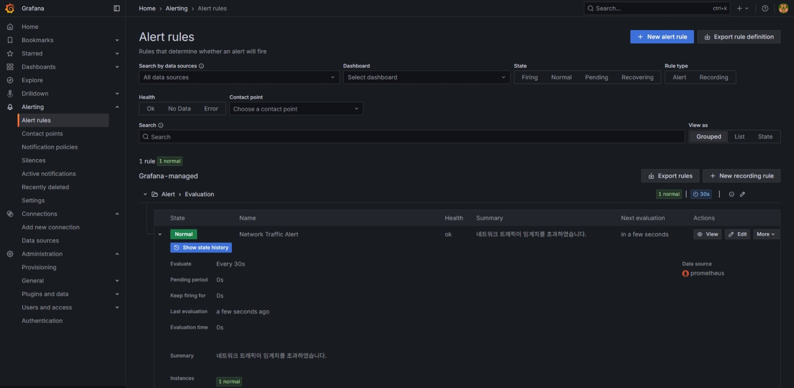<br>
      <sub>Grafana 알림 설정 화면</sub>
    </td>
    <td align="center">
      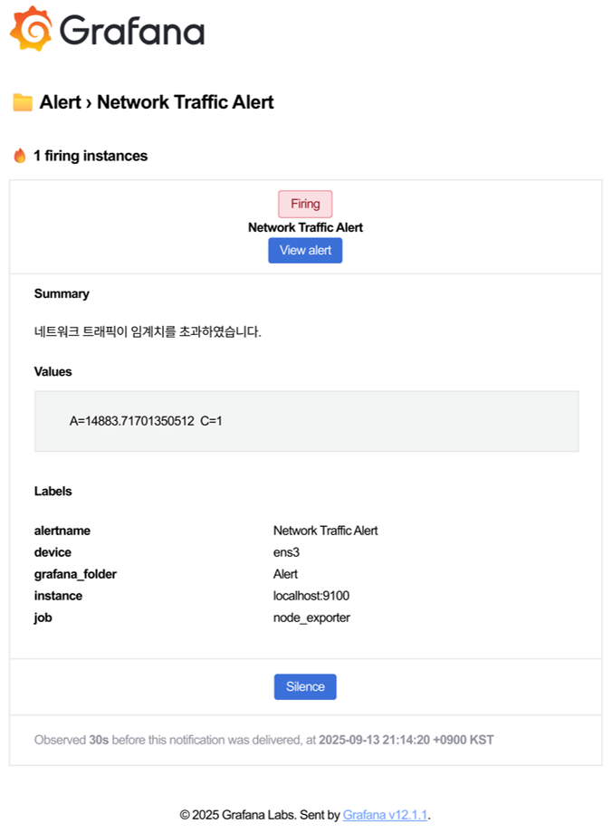<br>
      <sub>Grafana 알림 이메일</sub>
    </td>
  </tr>
</table>

<br>

## 7. 🪛 트러블 슈팅

- **문제 :** Terraform으로 인스턴스를 생성한 후에 클라우드 콘솔에서 직접 설정을 변경하는 경우, Terraform과 동기화가 되지 않는 문제
  - **고민 :** 콘솔에서 직접 변경한 설정이 Terraform 상태에 반영되지 않아서 실제 리소스와 코드 정의 간 불일치가 발생하고, 이로 인해 인프라의 안정성이 우려되었습니다.
  - **해결 :** `terraform import` 명령어를 사용하여 콘솔에서 추가된 리소스를 Terraform의 상태 파일로 가져오고, 설정을 직접 맞춰주어 해결하였습니다.

- **문제 :** Oracle Cloud 콘솔 사이트에서 인스턴스를 생성할 경우에는 SSH 접속에 필요한 키 쌍을 제공하지만, Terraform에서는 기본적으로 키 생성 기능을 제공하지 않기 때문에, 별도로 키를 준비하거나 다른 방법을 사용해야 하는 문제
  - **해결 :** tls_private_key, local_file 공급자(Provider)를 설치하고, 인스턴스 생성 시 OpenSSH 키 쌍(공개키, 비밀키)도 같이 생성되도록 하여 해결하였습니다.
    ```
    metadata = {
      ssh_authorized_keys = tls_private_key.ssh_key.public_key_openssh
    }
    ```
    ```
    resource "tls_private_key" "ssh_key" {
      algorithm = "RSA"
      rsa_bits  = 2048
    }

    resource "local_file" "private_key" {
      content         = tls_private_key.ssh_key.private_key_openssh
      filename        = "./.oci/ssh_priv.key"
      file_permission = "0600"
    }
    ```

- **문제 :** 외부 인터넷에서 Oracle Cloud의 Linux VM 인스턴스로 가동 중인 WordPress 블로그 사이트에 접속할 수 없는 문제.
  - **고민 :** Oracle Cloud 콘솔 사이트에서 VCN 보안 규칙 - 수신 허용 규칙에 80, 443 포트를 수신 허용으로 설정하여도 접속이 되지 않음.
  - **해결 :** Oracle Cloud에서 생성되는 Linux VM 인스턴스는 기본적으로 ufw가 아닌 iptables를 사용하고 있었으며, iptables 방화벽에서도 80, 443 포트의 수신 규칙을 허용으로 설정하여 해결하였습니다. 콘솔 보안 규칙뿐만이 아닌 방화벽 규칙에서도 수신 허용하는 규칙이 필요하였으며, 추가로 자신의 컴퓨터에서만 접속할 수 있도록 소스 CIDR 값을 자신의 공인 IP 주소 대역으로 설정하여 보안성을 높였습니다.
    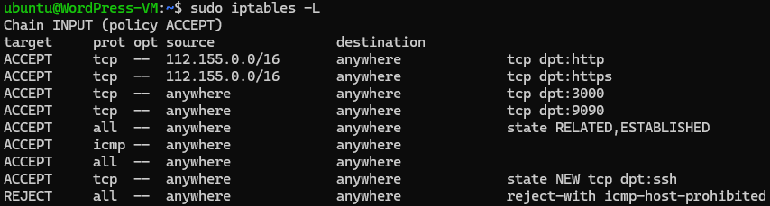

<br>

## 8. 📊 프로젝트 성과 및 느낀점

- Terraform을 이용한 클라우드 리소스 생성 및 관리 작업을 진행하면서, IaC 도구를 통한 클라우드 리소스 관리의 장점 및 편리함을 알게 되었습니다.
  - 여러 개의 클라우드 리소스를 한꺼번에 생성하고 관리한다면, IaC 도구를 사용하는 것이 효율적이라는 것을 알게 되었습니다.
  - Terraform의 공급자(Provider)를 설치하고, 공급자의 특정 버전을 지정하는 방법을 알게 되었습니다.
  - Terraform의 import 명령어를 사용하여, 콘솔에서 직접 생성한 리소스를 Terraform 상태 파일로 가져오는 방법을 알게 되었습니다.
- Prometheus와 Grafana를 활용하여 클라우드 시스템의 CPU, RAM, Network, Disk 사용량 등의 메트릭 정보를 수집하고, Grafana에서 이를 시각화하여 시스템 상태를 실시간으로 파악하고, 문제 발생 시 신속하게 대응할 수 있는 체계를 마련하였습니다.
- PromQL을 활용하여 다양한 쿼리를 작성하고, 이를 통해 기본적으로 제공되는 메트릭 외에도 사용자 정의 메트릭을 생성하여 모니터링할 수 있는 방법을 배웠습니다.
- Grafana의 알림 기능을 활용하여 특정 메트릭이 임계치를 초과할 경우 이메일로 알림을 받도록 설정하여, 시스템 장애에 신속하게 대응할 수 있는 체계를 구축하였습니다.
  - 예를 들어, 비정상적인 네트워크 트래픽을 감지하거나, CPU 사용량 또는 시스템의 부하가 심한 경우 알림을 받도록 설정하여, 빠르게 문제를 인지하고 대응할 수 있으리라 생각합니다.
